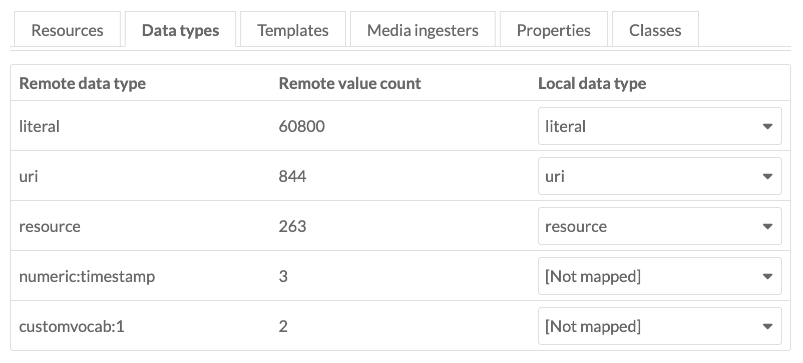
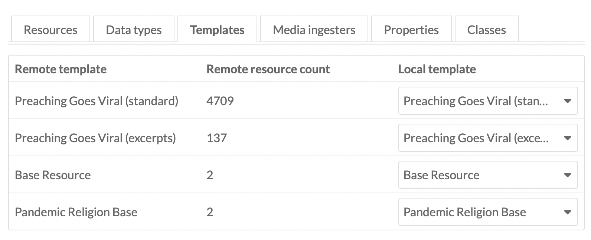
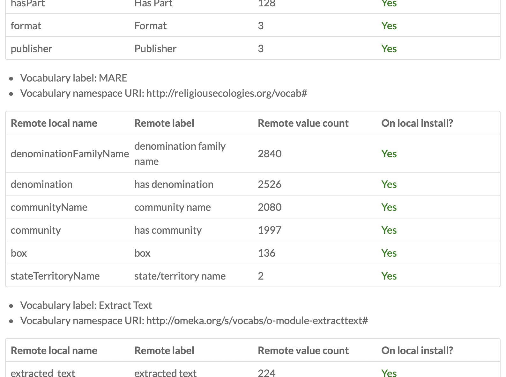

# Preaching Goes Viral File Sync 

After you have a brand new installation of Omeka S 3.1.0 ready, you'll need to first install the following modules:

1. Osii <https://github.com/omeka-s-modules/Osii>
2. ExtractText

## Osii 

To get Osii to work, we need to make a slight adjustment to the configuration file. Under `assets > config > module.ini` we need to adjust line 3 of the file: 

```omeka_version_constraint = "^3.2.0-alpha"```

to 

```omeka_version_constraint = "^3.1.0"```

After you've done this, head to the Module page in the Omeka S admin and finish installing the modules.

## Preparing for Import

Before we can start the import, we need to have a few resources in place to make sure vocabularies and metadata are mapped correctly. 

### Resource Templates

Under the Resource templates section of the Omeka admin, select "Import" in the upper right. You'll need the following Resource templates which you can download from this repository: 

- Pandemic Religion Base: `Pandemic_Religion_Base.json`
- Preaching Goes Viral (excerpts): `Preaching_Goes_Viral_excerpts_.json`
- Preaching Goes Viral (standard): `Preaching_Goes_Viral_standard_.json`

Import each of these resource templates individually, selecting "Review import" and "Complete import" in the upper right when prompted.

### Vocabularies

We also need to set up the custom RDF vocabularies. For this, you'll need to download the `mare.ttl` file from this repository. Then, under the Vocabularies section of the Omeka admin, select "Import new vocabulary" in the upper right. For the settings, include the following exactly as they are: 

- Label: MARE
- Namespace URI: http://religiousecologies.org/vocab#
- Namespace prefix: mare

Under "Choose File," select the mare.ttl file. Then click "Import" in the upper right. 

## Working with the Pandemic Religion API 

To start the sync of the existing files:

1. Click on the Omeka S Item Importer on the lowerleft of the Omeka admin screen.

2. Click "Add a new import," or the "Add import" button in the upper right.

3. Use the following settings: 

- Root endpoint: https://pandemicreligion.org/api/
- Query: site_id=5
- Key identity: provided via email
- Key credential: provided via email
- Add an import label to the Local configuration (e.g., pgv).
- **Note**: After you've completed your import, I plan to revoke the API keys I've provided. If you should need access to the API again for some reason, please let me know.

4. Click "Submit" in the upper right. 

5. After clicking submit, you'll be on the page to prepare an import. Select "Take snapshot" on the right side under "Import actions," and click "Confirm take snapshot." You can select "Refresh status" to update this page and wait for the snapshot to complete. It's iterating over a lot of items, so this may take a couple minutes.

6. After the snapshot is ready, you'll see the page updated with a series of tabs.

**Resources**: This summarizes items, media, and item sets between the Remote (our server), and Local (your server).

**Data types**: We need to map these to the correct data types by simply selecting their corresponding local data type. So, a Remote data type of `literal` should have a Local data type of `literal`. You'll note there are not corresponding mapping values for `numeric:timestamp` and `customvocab:1` -- we can safely skip these. 



**Templates**: For the templates to work, you'll need to ensure you followed the "Resource templates" instructions above. Like the data types, we just need to match up the Remote template to the Local template (Preaching Goes Viral (standard) = Preaching Goes Viral (standard), etc.). 



**Media ingesters**: This brings over the files from the PGV archive; unfortunately, however, *there isn't a way to import the content that was added via sideloading*. But if your primary focus right now is fixing duplicates and correcting metadata, I'm assuming these missing files won't be a major issue and can be taken care of on the PGV site when you're ready. 

**Properties**: These map vocabularies, and you'll need to be sure you followed the steps above under Vocabularies. If you've done this correctly, you should see `yes` under `On local install?` for every item listed here. 



**Classes**: Similar to properties, these should also have `yes` listed under `On local install?`

7. Once you've ensured your import settings look good, click "Submit" in the upper right. 

8. After submitting, you are now ready to sync the data over. Click on "Import snapshot" under "Import actions" and the process will begin. Since we're importing quite a lot of information, this may take up to five minutes or so to complete. Like the snapshot step above, you can select "Refresh status" to check on the status of the import. 

9. Once the import is done, you now have a copy of the data! 
